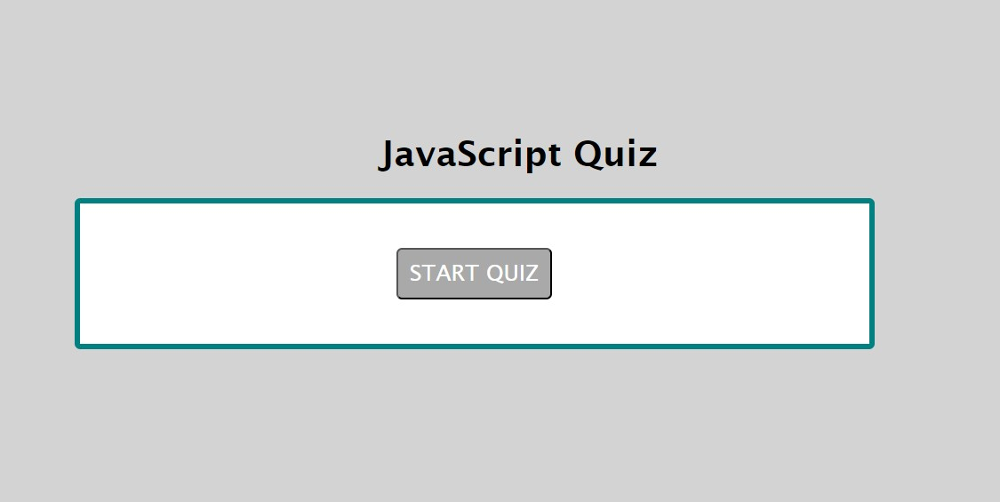
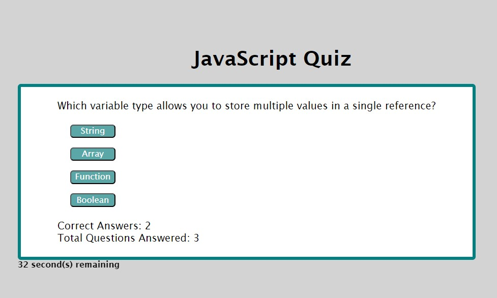
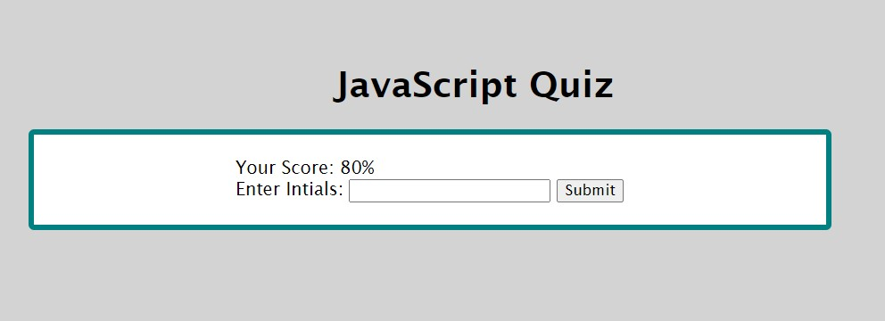

# Timed-JavaScript-Quiz

## Description

A timed JavaScript quiz to help me study the fundamentals of JavaScript.
This quiz will help me practice for interview settings where I might have a
live assessment and interactive coding challenges.

## Installation

URL: https://natalieyaspo.github.io/Timed-JavaScript-Quiz/

## Usage

When user clicks the Start Quiz button, they are taken through a series of questions
relating to the fundamentals of JavaScript.

User will click on the button for the answer they select and are moved to the next question.

If the user selects the wrong answer, extra time comes off of the timer.
Once the time is up, the user will be shown their final score and asked to enter their initals.

Then the user is taken to the High Score screen.

## Credits

Web Dev Simplified: Build a Quiz App with JavaScript - used to help me structure my page in a logical sense to make the quiz work, showing only 1 question at a time.

Collaborated with:
Peters, Sasha, office hours via Zoom, December 18 & 19, 2023.

## License

None needed.
